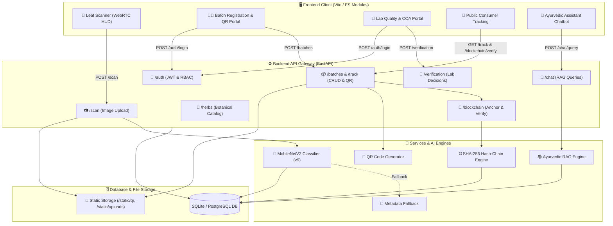

# 🏛️ Farm2Ayur — System Architecture Document

> **"From Soil to Synergy"** — Technical architecture, component design, data layer, and cryptographic provenance model for the Farm2Ayur platform.

---

### 📋 System Metadata

| Attribute | Details | Attribute | Details |
| :--- | :--- | :--- | :--- |
| **System Name** | **Farm2Ayur** | **Current Stage** | 🟡 Prototype (v1.0) |
| **Architecture** | Decoupled Full-Stack Web App | **Backend API** | FastAPI (Python 3.10+) · Uvicorn |
| **Frontend** | Vite · Vanilla HTML5 / CSS3 / ES Modules | **Database** | SQLite (Dev) / PostgreSQL · SQLAlchemy 2.0 |
| **AI Vision Engine** | MobileNetV2 (`farm2ayur-v9`, 5 Classes) | **Traceability** | Internal SHA-256 Hash Chaining (Mock-Chain) |

---

## 1. System Overview

**Farm2Ayur** is an end-to-end digital provenance, AI botanical identification, and supply chain verification platform for Ayurvedic medicinal herbs.

The platform is designed with a **modular, decoupled architecture**:
- **Frontend Client:** Responsive web application for WebRTC leaf scanning, batch logging, quality verification, and public QR tracking.
- **Backend API Gateway:** High-performance FastAPI REST service enforcing JWT-based Role-Based Access Control (RBAC) and Pydantic validation.
- **AI & Knowledge Subsystems:** MobileNetV2 neural leaf classifier and an Ayurvedic RAG engine querying verified botanical records.
- **Provenance Layer:** Internal SHA-256 hash-chained ledger providing deterministic tamper-evidence for batch milestones.
- **Persistence Layer:** Cross-dialect SQLAlchemy ORM managing users, botanical taxonomies, batch lifecycles, and audit records.

---

## 2. Architecture Diagram

---

## 3. Frontend Architecture

The client is a lightweight, high-performance web application built with **Vite**, modern **HTML5**, custom **CSS3 variables (glassmorphism)**, and **ES Modules**:

- **Core Views:**
  - `scan.html` / `scan.js`: Real-time leaf scanner HUD with WebRTC live camera (`getUserMedia`), macro zoom, torch toggle, and fallback ambient simulator with drag-and-drop support.
  - `index.html`: Main portal, supply chain timeline, pharmacopeia directory, and public batch provenance tracker.
  - `about.html`: Platform botanical heritage and scientific methodology.
  - `login.html` / `script.js`: Role-based authentication portal (`user`, `collector`, `verifier`, `admin`).
- **Backend Communication:** Asynchronous `fetch()` calls transmitting JSON payloads and `multipart/form-data` uploads, authenticated via Bearer JWT tokens.

---

## 4. Backend & APIs

The backend is built with **FastAPI** on **Uvicorn**, structured with clean separation between routers, services, schemas, and models:

| Router | Prefix | Access | Key Responsibilities |
| :--- | :--- | :--- | :--- |
| **`auth`** | `/auth` | Public / User | Registration, login, JWT token issuance, and current user profile (`/auth/me`). |
| **`herbs`** | `/herbs` | Public | Botanical catalog, vernacular/Sanskrit names, and therapeutic profiles. |
| **`batches`** | `/batches` | Collector / Verifier / Admin | Batch creation, 5-stage milestone tracking, status updates, and QR image serving. |
| **`scan`** | `/scan` | Authenticated | Image upload, MobileNetV2 inference execution, and user scan history. |
| **`verification`** | `/verification` | Verifier / Admin | Lab quality decisions (`approved`, `rejected`) and Certificate of Analysis (COA) PDF linking. |
| **`blockchain`** | `/blockchain` | Public / Role-Gated | Batch ledger snapshot anchoring, transaction lookup, and hash-chain integrity verification. |
| **`chat`** | `/chat` | Authenticated | RAG conversational assistant querying verified herb and document datasets. |
| **`uploads`** | `/uploads` | Authenticated | Upload handler for COA PDF documents and botanical imagery. |
| **`admin`** | `/admin` | Admin Only | Platform telemetry, batch overview, and user management. |
| **`track`** | `/track/{batch_code}` | Public | Public endpoint for instant batch provenance and milestone timeline retrieval. |

---

## 5. Database & Data Layer

Persistence is managed through **SQLAlchemy 2.0** with cross-dialect support for local **SQLite** (`ayurvedic.db`) and production **PostgreSQL**:

| Domain | Tables | Key Fields & Purpose |
| :--- | :--- | :--- |
| **Users & Access** | `users` | `id`, `email`, `hashed_password`, `role`, `organization` — RBAC access control. |
| **Botanical Data** | `herbs`, `herb_names`, `habitats`, `traditional_info`, `safety_info` | Taxonomy, Sanskrit synonyms, geographical zones, therapeutic uses, and safety warnings. |
| **Supply Chain** | `batches`, `batch_events` | `batch_code`, GPS coordinates, timestamps, quantity (kg), status, and milestone event history. |
| **Lab Verification** | `verification_records` | `target_type`, `decision`, `confidence_score`, `evidence_url` — Lab quality decisions and COA links. |
| **Provenance** | `blockchain_records` | `batch_id`, `data_payload` (JSON), `data_hash` (SHA-256), `previous_hash`, `transaction_hash`. |
| **AI & Knowledge** | `ai_scan_records`, `knowledge_documents`, `chat_history` | Leaf scan logs, verified Ayurvedic literature, and conversational chat history. |

---

## 6. AI/ML and RAG Integration

### AI Plant Identification (`app/services/ai_identifier.py`)
- **Model Architecture:** Custom fine-tuned **MobileNetV2** (`farm2ayur-v9`), serialized as `farm2ayur_v9_best.keras`.
- **Target Species (5):** *Amla, Ashwagandha, Guduchi, Neem, Tulsi*.
- **Inference Pipeline:**
  1. Input leaf image is resized to 224×224 RGB and normalized to a `(1, 224, 224, 3)` tensor.
  2. MobileNetV2 singleton executes forward pass, generating a softmax probability distribution.
  3. Top prediction is linked to database `herbs` records; if confidence is below **0.55**, a `low_confidence` warning is returned.
  4. If deep learning dependencies are unavailable, a regex metadata matcher acts as an automated heuristic fallback.

### Ayurvedic RAG Assistant (`app/services/rag_engine.py`)
- **Context Retrieval:** Matches user query tokens against indexed botanical parameters (`primary_name`, `sanskrit_name`, `scientific_name`) and verified `knowledge_documents`.
- **Grounded Response Synthesis:** Assembles classical Sanskrit names, therapeutic uses (*TraditionalInfo*), native habitat (*HabitatDistribution*), and safety notes (*SafetyInfo*).
- **Safety Compliance:** Automatically appends a standard Ayurvedic medical disclaimer to every query response.

---

## 7. Blockchain and Traceability

### Batch Lifecycle Milestones
Every batch progresses through five tracked milestone events:
$$\text{Harvested} \longrightarrow \text{Processed} \longrightarrow \text{Quality Verified / Rejected} \longrightarrow \text{In Transit} \longrightarrow \text{Delivered}$$

### SHA-256 Cryptographic Hash Chaining (`app/services/blockchain.py`)
To guarantee tamper-evidence without transaction costs, Farm2Ayur implements an **internal hash-chained ledger**:
1. **Canonical JSON Serialization:** Batch metadata and event history are deterministically serialized with sorted keys.
2. **SHA-256 Digest:** A 64-character hash is computed over the canonical payload:
   $$\text{data\_hash} = \text{SHA-256}(\text{Canonical JSON})$$
3. **Chain Linkage:** The new block records the previous block's hash as `previous_hash`, forming an unbroken cryptographic chain.
4. **Integrity Verification:** The `verify_batch_records` service verifies all records for a batch by recalculating each hash and validating parent-child links.

### Current Implementation vs. Future Scope

| Feature | 🟡 Implemented (Internal Mock-Chain) | 🔵 Planned (Public Blockchain) |
| :--- | :--- | :--- |
| **Network Type** | Internal zero-gas service (`network: "mock-chain"`) | Public Ethereum / Polygon Network |
| **Ledger Storage** | Relational database (`blockchain_records` table) | Decentralized Smart Contract State |
| **Transaction Fees** | $0.00 (Zero Gas) | Native Network Gas (ETH / MATIC) |
| **Verification** | Instant cryptographic recalculation via API | Global on-chain consensus & Merkle proofs |
