# 🎨 Farm2Ayur — Design System Specification

> **"From Soil to Synergy"** — Visual design tokens, component architecture, color palette, and UI specifications for the Farm2Ayur platform.

---

### 📋 System Metadata

| Attribute | Details | Attribute | Details |
| :--- | :--- | :--- | :--- |
| **Project Name** | **Farm2Ayur** | **Current Stage** | 🟡 Prototype (v1.0) |
| **Design Framework** | Vite · Vanilla HTML5 / CSS3 / ES Modules | **Design Philosophy** | Frosted Glassmorphism & Botanical Elegance |
| **Typography** | Cinzel · Outfit · Plus Jakarta Sans | **Primary Palette** | Emerald (`#10b981`), Gold (`#eab308`), Obsidian |
| **Target Viewports** | Mobile (<768px), Tablet, Desktop | **Interactive Preview** | [`docs/design-preview.html`](./design-preview.html) |

> 💡 **Interactive Visual Showcase:** Open [`docs/design-preview.html`](./design-preview.html) in any modern browser for live interactive swatches, typography specimens, and UI components rendered with native CSS glassmorphism.

---

## 1. Design Overview

Farm2Ayur unites traditional Ayurvedic botanical heritage with modern digital ag-tech aesthetics. The interface emphasizes **frosted glassmorphism**, **botanical emerald accents**, **ambient motion**, and **high-contrast typography**.

```mermaid
flowchart LR
    subgraph Tokens ["🎨 Design Tokens"]
        C[Color Palette]
        T[Typography Scale]
        E[Shadows & Elevation]
        R[Border Radii Scale]
    end

    subgraph Foundations ["🌿 Core Foundations"]
        G[Glassmorphic Blurs]
        M[Organic Mesh Blobs]
        A[Micro-Animations]
    end

    subgraph Components ["🧩 Component Layer"]
        B[Buttons & Controls]
        K[Cards & Containers]
        I[Form Inputs]
        H[HUD Status Badges]
    end

    subgraph Views ["📱 Interface Views"]
        V1[Scanner HUD View]
        V2[Public Provenance Tracker]
        V3[Pharmacopeia & Science]
        V4[Role Portal & Auth]
    end

    Tokens --> Foundations --> Components --> Views
```

### Core Design Principles
- 🌿 **Frosted Glassmorphism:** Translucent panels (`backdrop-filter: blur(12px–18px)`), subtle borders (`rgba(16, 185, 129, 0.25)`), and elevated radial glow shadows.
- ⚡ **Botanical Emerald & Gold Tones:** Plant greens (`#10b981`, `#064e3b`), laser cyan highlights (`#06b6d4`), and golden accents (`#eab308`, `#fef08a`).
- 👁️ **Dynamic Micro-Interactions:** Reactive cursor lighting, ambient mesh floaters, WebRTC camera HUD overlays, laser scanning sweeps, and smooth hover scaling.
- 📜 **Heritage & Modern Geometry:** Pairings of classical serif titles (*Cinzel*) with ultra-clean sans-serif body text (*Plus Jakarta Sans*, *Outfit*, *Montserrat*).

---

## 2. Color Palette

Every color below is extracted directly from `styles.css`, `scan.css`, and `about.css`:

| Swatch | Color Name | HEX / RGBA Value | CSS Token | Role & Usage | Status |
| :---: | :--- | :--- | :--- | :--- | :---: |
|  | **Primary Emerald** | `#10b981` | `--emerald-primary` | Main action buttons, reticle corners, focus rings | ✅ Implemented |
|  | **Emerald Light** | `#34d399` | `--emerald-light` | Accent highlights, reticle laser line, positive badges | ✅ Implemented |
|  | **Emerald Dark** | `#047857` / `#064e3b` | `--primary-dark` | High-contrast headers, dark text accents, badges | ✅ Implemented |
|  | **Cyan Accent** | `#06b6d4` / `#0d9488` | `--cyan-accent` | Cyber laser scans, secondary glows, HUD pills | ✅ Implemented |
|  | **Gold Primary** | `#eab308` → `#ca8a04` | Gold Gradient | Login CTAs, primary gold buttons, highlight badges | ✅ Implemented |
|  | **Gold Light** | `#fef08a` | `--text-gold` | Display headings, icon borders, outline button text | ✅ Implemented |
|  | **Deep Mesh Warm** | `#FAF3E2` | `--bg-deep-mesh` | Scanner page background, organic warm canvas | ✅ Implemented |
|  | **Deep Obsidian** | `#0c1813` | Body BG | Login dark backdrop, background video vignette | ✅ Implemented |
|  | **Text Primary** | `#0f291e` / `#0f172a` | `--text-primary` | Main readable body copy, high-contrast headings | ✅ Implemented |
|  | **Text Muted** | `#334155` / `#64748b` | `--text-muted` | Subtitles, secondary descriptions, HUD labels | ✅ Implemented |
|  | **Frosted Glass** | `rgba(255, 255, 255, 0.96)` | `--obsidian-glass` | Scanner card wrapper, modal card backdrops | ✅ Implemented |
|  | **Translucent Glass**| `rgba(10, 18, 14, 0.12)` | Container Glass | Authentication panels, sliding glass overlay | ✅ Implemented |

---

## 3. Typography Hierarchy

The type system blends classical serif dignity with agile, readable sans-serif geometric fonts:

| Font Family | Classification | Weights | Intended Role | Sample Applied Elements |
| :--- | :--- | :--- | :--- | :--- |
| **`Cinzel`** | Serif (Classical) | `700`, `800` | **Brand & Hero Headings** | Page titles (`h1`), modal headings, brand wordmark |
| **`Outfit`** | Sans-Serif (Modern) | `700` | **HUD & Shimmer Labels** | Camera titles, scanner HUD headers, activation cards |
| **`Plus Jakarta Sans`** | Sans-Serif (Clean) | `400`–`700` | **Primary Body & Inputs** | Scanner UI, form inputs, navigation links, default body |
| **`Montserrat`** | Sans-Serif (Geometric) | `500`–`700` | **Content & Badges** | About page paragraphs, tracking tags, intro pills |
| **`Bebas Neue`** | Display (Condensed) | `400` | **Numeric Accents** | Background member numbers, team display headers |

---

## 4. UI Components

### 4.1 Buttons & Controls

| Component | Selector / Class | Key CSS Specification | Visual Appearance & Behavior |
| :--- | :--- | :--- | :--- |
| **Emerald Pill CTA** | `.btn-emerald` | `background: linear-gradient(135deg, #10b981, #059669, #047857)` `border-radius: 50px; box-shadow: 0 4px 20px rgba(16, 185, 129, 0.45)` | Glowing emerald pill; scales `1.03x` with elevated glow on hover |
| **Gold Primary CTA** | `.btn-primary` | `background: linear-gradient(135deg, #eab308, #ca8a04)` `color: #040907; border-radius: 50px` | High-contrast gold pill; scales `1.04x` with gold shadow on hover |
| **Outline Glass CTA** | `.btn-outline` | `background: rgba(0, 0, 0, 0.25)` `border: 1px solid rgba(254, 240, 138, 0.7); color: #fef08a` | Translucent dark button with thin gold border; gold glow on hover |
| **Scanner Circular Nav** | `.scanner-nav-btn` | `width: 42px; height: 42px; border-radius: 50%` `border: 1px solid rgba(16, 185, 129, 0.25); color: #064e3b` | Circular frosted white icon button; scales `1.08x` with emerald glow |

### 4.2 Cards & Containers

| Component | Selector / Class | Key CSS Specification | Visual Appearance & Behavior |
| :--- | :--- | :--- | :--- |
| **Frosted Glass Container** | `.container` | `background: rgba(10, 18, 14, 0.12); backdrop-filter: blur(16px)` `border: 1px solid rgba(255, 255, 255, 0.18); border-radius: 30px` | 840px centered authentication card with ultra-translucent glass |
| **Camera Scanner Box** | `.camera-scanner-wrapper` | `max-width: 520px; height: 88vh; border-radius: 36px` `border: 1.5px solid rgba(16, 185, 129, 0.25); box-shadow: 0 25px 70px rgba(16, 185, 129, 0.12)` | Standalone rounded mobile-first HUD box with top bar and viewport |
| **Activation Overlay Card**| `.activation-card` | `backdrop-filter: blur(18px); border-radius: 28px` `border: 1.5px solid rgba(16, 185, 129, 0.25)` | Centered floating permission card with glowing corner reticles |

### 4.3 Badges & Status Indicators

| Component | Selector / Class | Key CSS Specification | Visual Appearance & Behavior |
| :--- | :--- | :--- | :--- |
| **HUD Stat Pill** | `.hud-stat-pill` | `background: rgba(255, 255, 255, 0.92); border-radius: 50px` `border: 1px solid rgba(16, 185, 129, 0.25); font-size: 0.72rem` | Frosted pill displaying live telemetry (Lighting, Focus, Match %) |
| **Pulsing Status Dots** | `.dot-emerald` / `.dot-cyan` | `width: 7px; height: 7px; border-radius: 50%` `animation: pulse-dot 1.8s infinite` | Micro status indicators that breathe with colored radial box-shadows |
| **Tracking Badges** | `.intro-badge`, `.leaf-badge` | `padding: 8px 24px; border-radius: 999px` `letter-spacing: 6px; text-transform: uppercase` | High-tracked label badge with translucent borders and soft glow |

### 4.4 Form Controls

| Component | Selector / Class | Key CSS Specification | Visual Appearance & Behavior |
| :--- | :--- | :--- | :--- |
| **Glass Input Field** | `input` | `background: rgba(0, 0, 0, 0.3); border-radius: 14px` `border: 1px solid rgba(255, 255, 255, 0.22); color: #ffffff` | Dark translucent input with light placeholder; glows emerald on focus |
| **Focused Input Ring** | `input:focus` | `border-color: #10b981; box-shadow: 0 0 15px rgba(16, 185, 129, 0.4)` `background: rgba(0, 0, 0, 0.45)` | Vibrant emerald focus halo providing clear keyboard interaction feedback |

---

## 5. Layout, Spacing & Elevation

### 5.1 Max-Width Scale

| Scale Role | Value | Target Components | Purpose |
| :--- | :--- | :--- | :--- |
| **Scanner Viewport** | `520px` (height: 88vh) | `.camera-scanner-wrapper` | Mobile-focused AI camera viewport HUD |
| **Auth Container** | `840px` (max-width: 95%) | `.container` | Split-view sign-in / sign-up sliding glass panel |
| **Content Hero** | `1100px` | `.about-content`, `.team` | Readable document text and two-column member layouts |

### 5.2 Border Radius Scale
- **`50px` / `999px` (Pill):** Action buttons (`.btn-emerald`, `.btn-primary`), HUD status pills, badge containers.
- **`36px` / `30px` / `28px` (Card):** Main glass cards (`.container`), scanner wrappers, modal dialogs.
- **`14px` / `12px` / `8px` (Element):** Form inputs, icon containers, botanical tag chips.

### 5.3 Elevation & Shadows
- **Elevated Glass Shadow:** `0 25px 70px rgba(16, 185, 129, 0.12), 0 4px 25px rgba(0, 0, 0, 0.04)`
- **Card Border Inset:** `inset 0 1px 0 rgba(255, 255, 255, 0.8)`
- **Emerald Glow Halo:** `0 4px 20px rgba(16, 185, 129, 0.45), 0 0 15px rgba(16, 185, 129, 0.25)`

---

## 6. Responsive Design

| Breakpoint / Context | Layout Adjustments | Applied CSS Rule |
| :--- | :--- | :--- |
| **Mobile (`<768px`)** | Two-column cards stack into a single vertical column; padding reduces for compact viewports | `@media (max-width: 768px) { .member { flex-direction: column; } }` |
| **Fluid Typography** | Large display headers scale dynamically based on viewport width without overflow | `font-size: clamp(60px, 10vw, 170px); line-height: 0.9;` |
| **Adaptive Height** | Scanner box stays within mobile screen limits while maintaining reticle aspect ratio | `height: 88vh; min-height: 680px; max-height: 840px;` |

---

## 7. Accessibility

| Capability | Implementation Detail | Status |
| :--- | :--- | :---: |
| **Keyboard Shortcuts** | `Space` (shutter scan), `T` (torch toggle), `Z` (macro zoom), `Escape` (dismiss modal/drawer) | ✅ Implemented |
| **Focus Rings** | Dedicated `:focus-visible` styles with `outline: 2px solid #10b981; outline-offset: 3px` | ✅ Implemented |
| **Text Contrast** | High-contrast white (`#ffffff`) and deep green (`#0f291e`) on frosted glass backdrops | ✅ Implemented |
| **ARIA Semantic Tags** | Planned addition of `aria-live="polite"` for HUD diagnostics and `role="dialog"` for modals | 🔵 Planned |
