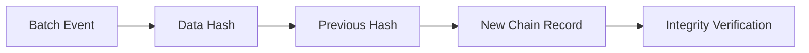

# Product Requirements Document (PRD) — Farm2Ayur

**Project Name:** Farm2Ayur  
**Stage:** Hackathon Prototype (v1.0)  
**Primary Focus:** Ayurvedic Herb Traceability, AI Leaf Identification & Cryptographic Provenance  
**Target Date:** October 2026  

---

## 1. Product Overview

**Farm2Ayur** is an end-to-end digital provenance and plant identification platform designed to bring transparency, authenticity, and scientific rigor to the Ayurvedic medicinal herb supply chain. Operating under the theme *"From Soil to Synergy"*, the platform bridges classical Ayurvedic botanical knowledge with modern verification workflows, mobile AI plant recognition, and verifiable cryptographic data logging.

The system is architected as a decoupled full-stack application suitable for rapid hackathon deployment and future production scaling:

- **Frontend Client (`Farm2Ayur`):** A responsive, Vite-powered web client built using semantic HTML5, modular CSS design systems, and vanilla ES modules (with progressive enhancement animations via GSAP). The UI provides a consumer-facing landing portal, an interactive supply chain journey explorer, environmental telemetry visualizations, rich Ayurvedic botanical knowledge modules, and a dedicated AI Leaf Scanner interface with real-time video feed support. The architecture is intentionally organized so that UI components can be migrated directly to React without restructuring project tooling.
- **Backend API Service (`FastAPI`):** A high-performance Python REST API (`Ayurvedic Platform API`, v1.0.0) powered by FastAPI and SQLAlchemy ORM. The service supports SQLite for lightweight local hackathon development and PostgreSQL for scalable production deployments. It provides JWT-based role authentication, comprehensive herb catalog management, harvest batch serialization, QR code asset generation, verification review queues, cryptographic hash-chaining endpoints, and a knowledge-retrieval RAG service.
- **AI Identification Engine:** A botanical vision pipeline centered around the `farm2ayur-v9` convolutional neural network (MobileNetV2 architecture in Keras/TensorFlow) trained to identify 5 core Ayurvedic medicinal plant classes (*Amla*, *Ashwagandha*, *Guduchi*, *Neem*, and *Tulsi*). The scanner incorporates a heuristic metadata-matching fallback to ensure resilient offline demonstration during hackathon evaluations.
- **Provenance & Trust Layer:** A SHA-256 cryptographic ledger mechanism that constructs verifiable hash chains across batch lifecycle milestones, paired with a simulated broadcast service (`mock-chain`) for deterministic verification without external blockchain gas costs.

---

## 2. Problem Statement

The global resurgence in natural medicine and herbal wellness has placed unprecedented demand on Ayurvedic raw materials. However, modern herbal supply chains face structural vulnerabilities that undermine consumer safety, therapeutic efficacy, and industry credibility:

1. **Lack of Farm-to-Consumer Traceability:**  
   Most Ayurvedic remedies on retail shelves cannot be traced back to their geographical origin (*Desha*) or harvest season (*Ritu*). Consumers and herbal formulation brands have virtually no visibility into who harvested the plant, under what environmental conditions it grew, or how long it sat in transit.

2. **Species Substitution and Adulteration:**  
   High market demand and localized scarcity frequently lead to deliberate adulteration or inadvertent species substitution. Non-medicinal lookalike leaves are often harvested in place of authentic botanical varieties, directly diminishing therapeutic potency (*Virya*) and potentially introducing toxins.

3. **Vulnerability of Paper-Based Quality Assurances:**  
   Certificates of Analysis (COAs) and laboratory testing logs for heavy metals, moisture, and active phytochemical assays (such as Withaferin-A in Ashwagandha or Eugenol in Tulsi) are traditionally paper-bound or stored in disconnected databases. They are prone to loss, misattribution, and unauthorized alteration.

4. **Information Disconnect Between Traditional Wisdom and Modern Consumers:**  
   Classical Ayurvedic pharmacology evaluates medicinal substances through holistic dimensions—*Dravya* (substance), *Rasa* (taste), *Guna* (qualities), *Virya* (potency), *Vipaka* (post-digestive effect), and *Prabhava* (specific action). Modern consumers lack an engaging, verified educational bridge connecting these traditional frameworks with modern botanical science and clinical safety warnings.

5. **Operational Friction for Harvesters and Field Verifiers:**  
   Smallholder herb collectors and cooperative harvesters lack simple, accessible digital tools to record harvest events, geo-coordinates, and batch quantities at the point of collection.

---

## 3. Product Vision

The vision of **Farm2Ayur** is to establish an unbroken chain of trust and authentic knowledge from the soil of the cultivator to the daily remedy of the consumer.

Farm2Ayur aims to:
- Transform raw botanical harvesting into an accountable, verifiable digital pipeline where every parcel carries a verifiable digital passport.
- Democratize botanical identification by placing AI-assisted computer vision into the hands of cultivators, students, and consumers via everyday mobile cameras and web browsers.
- Honor and preserve authentic Ayurvedic heritage (aligned with classical frameworks and Ministry of Ayush guidelines) by combining traditional understanding with modern phytochemical standards and laboratory proof.
- Provide a clear, honest, and cost-effective blueprint for supply chain transparency that hackathons, cooperatives, and Ayurvedic manufacturers can immediately demonstrate and adopt.

---

## 4. Target Users

Farm2Ayur serves four distinct user roles, supported by the backend Role-Based Access Control (RBAC) model, alongside the general public.

| User Persona | Role Key in System | Primary Responsibilities & Goals | Key Platform Touchpoints |
| :--- | :--- | :--- | :--- |
| **End Consumers & Herbal Enthusiasts** | `user` / Public Guest | • Scan plant specimens using mobile or desktop cameras to identify herbs. • Look up batch codes via QR scans to inspect harvest origin and lab purity. • Learn about Ayurvedic properties (*Rasas*, *Doshas*, *Pancha Kalpana*). • Query the Ayurvedic chatbot for traditional usage notes and safety disclaimers. | • Public Landing Page (`index.html`) • AI Leaf Camera Scanner (`scan.html`) • Public Batch Tracking (`/track/{batch_code}`) • RAG Chat Assistant (`/chat/query`) |
| **Herb Collectors & Harvesters** | `collector` | • Register newly harvested herb batches at source (e.g., regional cooperatives). • Log harvest date, geographical location, GPS coordinates, and initial weight (kg). • Generate and print serialized batch QR codes for physical sacks and parcels. • Record initial lifecycle dispatch events. | • Collector Batch Registration (`/batches`) • QR Code Generation (`/batches/{batch_id}/qr`) • Event Logging (`/batches/{batch_id}/events`) |
| **Quality Verifiers & Lab Analysts** | `verifier` | • Review incoming raw herb batches, AI scan logs, and botanical profiles. • Validate laboratory assay findings (e.g., HPLC purity, active markers). • Submit formal verification decisions (`approved` or `rejected`) with confidence scores and evidence URLs. • Anchor verified milestones to the cryptographic ledger. | • Verification Console (`/verification`) • Batch Status Updates (`/batches/{batch_id}/status`) • Ledger Anchoring (`/blockchain/anchor`) • Knowledge Doc Verification (`/chat/knowledge`) |
| **Platform Administrators & Brand Managers** | `admin` | • Monitor system-wide supply chain telemetry and platform health. • Track aggregations: total users, batches by status, scan confidence ratios. • Manage user accounts, role escalations, and account activations. • Oversee catalog data for herbs, scientific synonyms, and safety precautions. | • Admin Analytics Dashboard (`/admin/dashboard`) • User Management (`/admin/users`) • Herb Master Catalog (`/herbs`) • Ledger Audit (`/blockchain/verify/{batch_id}`) |

---

## 5. Core Product Goals

To maintain focus and feasibility within the hackathon scope, Farm2Ayur prioritizes functional delivery across five core product goals:

### Goal 1: Reliable AI Plant Identification
- **Browser-Based Leaf Scanning:** Provide an accessible camera and image-upload interface (`scan.html`, `scan.js`) supporting live camera video streams, zoom control, torch simulation, and drag-and-drop file inspection.
- **5-Class Botanical Classification:** Deploy the `farm2ayur-v9` MobileNetV2 Keras model to classify five prominent Ayurvedic medicinal herbs:
  1. *Amla* (*Phyllanthus emblica*)
  2. *Ashwagandha* (*Withania somnifera*)
  3. *Guduchi* (*Tinospora cordifolia*)
  4. *Neem* (*Azadirachta indica*)
  5. *Tulsi* (*Ocimum sanctum*)
- **Confidence Scoring & Safe Fallbacks:** Enforce a confidence threshold (`0.55`). Low-confidence predictions prompt the user to retake the photo. If the machine learning runtime or weight file is unavailable, automatically invoke a heuristic metadata matcher to ensure uninterrupted demonstration.
- **Scan History Logging:** Automatically persist scan records in the database (`ai_scan_records`) with prediction rankings, confidence percentages, image URLs, and user linkage.

### Goal 2: Granular Batch Lifecycle Traceability
- **Standardized Batch Serialization:** Automatically generate structured batch codes (e.g., `B-2026-001`) with collector IDs, harvest dates, geographic text descriptions, latitude, longitude, and batch weight in kilograms.
- **Physical-Digital Linking via QR:** Automatically generate and serve scannable QR code PNGs (`/batches/{batch_id}/qr`) that map directly to the public batch tracking endpoint.
- **5-Stage Milestone Progression:** Support dynamic event logging along the supply chain lifecycle:
  1. *Harvested* (initial farm logging)
  2. *Processed* (drying, milling, or extraction)
  3. *Quality Tested* (NABL lab assay verification)
  4. *In Transit* (cold chain / regional logistics)
  5. *Delivered / Formulated* (packaging and retail readiness)

### Goal 3: Cryptographic Integrity & Tamper-Evident Ledger
- **Deterministic SHA-256 Hashing:** Build canonical JSON representations of batch data payloads and compute SHA-256 state hashes.
- **Hash Chaining:** Link each new batch event to the preceding event's hash (`previous_hash`), forming a verifiable audit chain.
- **Independent Integrity Verification:** Expose validation endpoints (`/blockchain/verify/{batch_id}` and `/blockchain/verify/code/{batch_code}`) that recompute hashes on the fly and confirm link continuity.
- **Realistic Hackathon Scope:** Anchor records to an explicit simulated network (`mock-chain`) with synthetic transaction hashes and wallet signatures, demonstrating cryptographic proof-of-concept without dependency on public testnet latency or gas costs.

### Goal 4: Human-in-the-Loop Quality Verification
- **Formal Review Workflow:** Provide a structured verification system (`verification_records`) where certified verifiers evaluate batches, herb definitions, or AI scan outputs.
- **Auditable Decisions:** Record verification outcomes (`approved`, `rejected`), verifier IDs, timestamps, numeric confidence scores (0.0 to 1.0), and external evidence URLs (such as laboratory COA documents).

### Goal 5: Curated Ayurvedic Knowledge & Safe RAG Interaction
- **Educational Botanical Modules:** Present interactive UI sections detailing classical Ayurvedic pharmacology: the 5 elements (*Pancha Mahabhuta*), 6 tastes (*Shad Rasa*), qualitative attributes (*Gunas*), potency (*Virya*), post-digestive impact (*Vipaka*), and preparations (*Pancha Kalpana*).
- **Retrieval-Augmented Chat Assistant:** Provide a conversational endpoint (`/chat/query`) that searches verified internal herb records and curated text documents (`knowledge_documents`), returning contextual answers along with cited sources.
- **Mandatory Safety Disclaimers:** Append standard medical disclaimers to AI chat responses to emphasize educational use and prevent clinical misinterpretation.

---

## 6. Core Features

Based on the implemented full-stack codebase, Farm2Ayur includes the following core features:

### 1. AI Medicinal Plant Identification
- **What it does:** Allows users to scan plant leaves using live camera video feeds or drag-and-drop image uploads (`scan.html`, `POST /scan/`). The backend executes the `farm2ayur-v9` MobileNetV2 convolutional neural network across 5 core Ayurvedic classes (*Amla*, *Ashwagandha*, *Guduchi*, *Neem*, *Tulsi*), outputting primary predictions, scientific names, top-3 ranked confidence scores, and historical scan logs (`GET /scan/history`). Includes an automated heuristic metadata fallback for resilient offline demonstration.
- **Who uses it:** End consumers, wildcraft herb harvesters, field collectors, and students.
- **Why it is useful:** Eliminates preliminary botanical misidentification and species substitution at the point of harvest or consumer purchase without requiring specialized laboratory hardware.

### 2. Batch Lifecycle & Harvest Traceability
- **What it does:** Allows collectors and administrators to initialize numbered harvest batches (`POST /batches/`, generating serial codes like `B-2026-001`) with harvest dates, geo-locations, GPS coordinates, and initial quantities in kg. Tracks sequential milestone events (`POST /batches/{batch_id}/events`) across 5 lifecycle stages: *Harvested*, *Processed*, *Quality Tested*, *In Transit*, and *Delivered*.
- **Who uses it:** Herb collectors, agricultural cooperatives, logistics operators, and platform admins.
- **Why it is useful:** Replaces error-prone paper manifests with an auditable, timestamped digital timeline capturing the exact environmental origin and chain-of-custody of each botanical parcel.

### 3. QR-Based Instant Batch Access & Public Tracking
- **What it does:** Generates dynamic, downloadable 2D QR code PNGs (`GET /batches/{batch_id}/qr`) mapped to public tracking endpoints (`GET /track/{batch_code}`). Anyone scanning the QR code can inspect the complete batch history, harvest coordinates, grower name, and lab testing status in their mobile browser without creating an account or logging in.
- **Who uses it:** Retail consumers, warehouse handlers, quality inspectors, and regulatory auditors.
- **Why it is useful:** Delivers instant, frictionless access to crop-to-remedy data directly from physical product packaging or storage sacks.

### 4. Cryptographic / Tamper-Evident Ledger Records
- **What it does:** Constructs canonical JSON payloads of batch states and generates deterministic SHA-256 cryptographic hashes (`POST /blockchain/anchor`). Links each new milestone event to the previous record's hash (`previous_hash`) and simulates anchoring to an audit network (`mock-chain`). Provides on-demand cryptographic verification endpoints (`GET /blockchain/verify/{batch_id}` and `GET /blockchain/verify/code/{batch_code}`) to mathematically validate data integrity.
- **Who uses it:** Quality auditors, compliance officers, brand managers, and verification analysts.
- **Why it is useful:** Prevents retroactive data alteration, guaranteeing that harvest weights, timestamps, and test results cannot be silently manipulated once recorded.

### 5. Quality Verification & Lab Evidence (COA) Management
- **What it does:** Provides a dedicated review pipeline (`POST /verification/`) where authorized verifiers review batches, botanical entries, or AI scan results. Verifiers record formal decisions (`approved`, `rejected`), assign confidence ratings (0.0–1.0), append notes, and attach digital evidence URLs (such as laboratory Certificates of Analysis). Approved decisions automatically transition the batch status to `verified`.
- **Who uses it:** Quality assurance inspectors, NABL-accredited laboratory technicians, and certifying botanists.
- **Why it is useful:** Establishes a verifiable human-in-the-loop checkpoint ensuring that only lab-tested, chemically validated botanical materials receive verified provenance status.

### 6. Ayurvedic Botanical & Pharmacology Knowledge Modules
- **What it does:** Structures and displays comprehensive Ayurvedic pharmacological data in the frontend and database (`/herbs` catalog): the 5 elements (*Pancha Mahabhuta*), the 6 tastes (*Shad Rasa*), qualities (*Guna*), potency (*Virya*), post-digestive impact (*Vipaka*), specific actions (*Prabhava*), Dosha dynamics (*Vata*, *Pitta*, *Kapha*), plant parts used, and traditional preparation forms (*Pancha Kalpana*).
- **Who uses it:** Consumers, wellness practitioners, researchers, and Ayurvedic educators.
- **Why it is useful:** Preserves and presents classical Ayurvedic concepts in a structured, accessible format alongside modern scientific nomenclature and safety guidelines.

### 7. RAG-Based Ayurvedic Chat Assistant
- **What it does:** Offers a conversational question-answering endpoint (`POST /chat/query`, `GET /chat/history`) powered by a Retrieval-Augmented Generation engine (`rag_engine.py`). Dynamically searches verified database herb profiles and authenticated knowledge documents (`knowledge_documents`), returning contextual answers with cited reference sources and mandatory medical safety disclaimers.
- **Who uses it:** End consumers and herbal enthusiasts seeking guided product and botanical information.
- **Why it is useful:** Provides instant, context-aware answers to user inquiries grounded in verified Ayurvedic knowledge while maintaining strict safety boundaries against unauthorized medical diagnosis.

### 8. Administrative Oversight & Analytics Dashboard
- **What it does:** Aggregates platform-wide telemetry for authorized administrators (`GET /admin/dashboard` and `GET /admin/users`), including total user counts by role, batch distributions by lifecycle status, AI scanner confidence metrics, recent system activity streams, and user role/activation controls.
- **Who uses it:** System administrators, cooperative leadership, and platform operators.
- **Why it is useful:** Gives platform managers complete operational visibility to oversee supply chain throughput, identify bottlenecks, and maintain system integrity.

---

## 7. User Workflows

The following operational workflows represent the actual data journeys supported by the Farm2Ayur backend API:

### 1. Medicinal Plant Scanning
- **Actor:** Consumer, Collector (`user`, `collector`)
- **Steps:** User uploads a leaf image or live feed -> System processes via `farm2ayur-v9` AI model -> Returns top predictions and confidence scores.
- **Relevant Route:** `POST /scan/`
- **Final Outcome:** A new `AIScanRecord` is saved, providing the user with immediate botanical identification and a confidence rating.

### 2. Batch Creation and Harvest Registration
- **Actor:** Harvester, Cooperative Admin (`collector`, `admin`)
- **Steps:** Collector registers a new harvest with herb ID, location, GPS coordinates, and weight -> System generates a unique batch code (e.g., `B-2026-001`) and a scannable QR code.
- **Relevant Route:** `POST /batches/`
- **Final Outcome:** A traceable batch is initialized in the `created` state, and an initial `harvested` event is logged to the timeline.

### 3. Batch Lifecycle Tracking
- **Actor:** Logistics Handler, Verifier (`collector`, `verifier`)
- **Steps:** Handler records a lifecycle transition (e.g., `shipped`, `delivered`) along with location data and notes -> System updates the batch timeline.
- **Relevant Route:** `POST /batches/{batch_id}/events`
- **Final Outcome:** The batch status is updated (e.g., `in_transit`), creating a granular, timestamped chain of custody.

### 4. QR Code / Public Batch Verification
- **Actor:** Consumer, Retail Auditor (Public Guest)
- **Steps:** User scans the batch QR code on physical packaging -> Client fetches batch history via the public API -> Displays harvest origin, timeline, and lab verification status.
- **Relevant Route:** `GET /batches/code/{batch_code}`
- **Final Outcome:** Transparent, read-only consumer access to the complete harvest-to-retail journey without requiring user authentication.

### 5. Quality Verification and COA
- **Actor:** Lab Analyst, Quality Inspector (`verifier`, `admin`)
- **Steps:** Verifier inspects batch lab results -> Submits an `approved` or `rejected` decision with a confidence score and an external evidence URL (like a COA PDF) -> System logs the decision.
- **Relevant Route:** `POST /verification/`
- **Final Outcome:** The batch status officially transitions to `verified`, legally and structurally distinguishing it from untested raw materials.

### 6. Cryptographic Traceability Verification
- **Actor:** Auditor, Compliance Officer (`verifier`, `admin`)
- **Steps:** System anchors the batch state to the ledger -> Generates a SHA-256 hash linked to the `previous_hash` -> Auditor queries the verification endpoint to mathematically validate the chain.
- **Relevant Route:** `POST /blockchain/anchor` and `GET /blockchain/verify/{batch_id}`
- **Final Outcome:** Cryptographic, tamper-evident proof that no past historical logs or quality metrics have been manipulated.

### 7. Ayurvedic Knowledge / RAG Chat
- **Actor:** Consumer, Enthusiast (`user`)
- **Steps:** User asks a natural language question -> RAG engine queries embedded `knowledge_documents` -> LLM constructs an answer citing specific Ayurvedic texts and safety disclaimers.
- **Relevant Route:** `POST /chat/query`
- **Final Outcome:** The user receives a contextual, verifiable educational response, which is permanently logged in their personal `ChatHistory`.

### Farm2Ayur Journey

---

## 8. Functional Requirements

The following functional requirements are derived directly from the current repository implementation.

### 1. Plant Identification
| ID | Requirement | Priority | Status |
| :--- | :--- | :--- | :--- |
| FR-01 | Provide AI leaf scanning endpoint with MobileNetV2 | P0 | Implemented |
| FR-02 | Support heuristic fallback logic for offline/low-resource use | P1 | Implemented |
| FR-03 | Retrieve personal AI scan history | P1 | Implemented |

### 2. User & Role Management
| ID | Requirement | Priority | Status |
| :--- | :--- | :--- | :--- |
| FR-04 | User registration and JWT-based authentication | P0 | Implemented |
| FR-05 | Enforce Role-Based Access Control (RBAC: user, collector, verifier, admin) | P0 | Implemented |
| FR-06 | Admin capability to manually activate or deactivate user accounts | P1 | Implemented |

### 3. Batch Management
| ID | Requirement | Priority | Status |
| :--- | :--- | :--- | :--- |
| FR-07 | Initialize harvest batches with auto-generated serial codes | P0 | Implemented |
| FR-08 | Search and filter batches by status, herb ID, or code | P1 | Implemented |
| FR-09 | Manually update batch status based on lifecycle progression | P0 | Implemented |

### 4. Traceability
| ID | Requirement | Priority | Status |
| :--- | :--- | :--- | :--- |
| FR-10 | Log discrete lifecycle events with timestamps, users, and locations | P0 | Implemented |
| FR-11 | Capture GPS coordinates during initial harvest registration | P1 | Implemented |

### 5. QR / Public Tracking
| ID | Requirement | Priority | Status |
| :--- | :--- | :--- | :--- |
| FR-12 | Generate dynamic QR code PNGs for physical batch tagging | P0 | Implemented |
| FR-13 | Support unauthenticated public batch history tracking via code | P0 | Implemented |

### 6. Quality Verification
| ID | Requirement | Priority | Status |
| :--- | :--- | :--- | :--- |
| FR-14 | Log formal verifier decisions (approve/reject) with confidence scores | P0 | Implemented |
| FR-15 | Attach external evidence URLs (e.g., COA PDFs) to verification records | P1 | Implemented |
| FR-16 | Retrieve full verification decision history for a specific batch | P1 | Implemented |

### 7. Blockchain / Integrity
| ID | Requirement | Priority | Status |
| :--- | :--- | :--- | :--- |
| FR-17 | Generate deterministic SHA-256 hashes of batch state payloads | P1 | Implemented |
| FR-18 | Anchor batch hashes to a simulated internal mock-chain | P1 | Implemented |
| FR-19 | Verify historical data integrity against on-chain hash chains | P1 | Implemented |
| FR-20 | Anchor ledger records to a live public blockchain testnet | P2 | Planned |

### 8. Ayurvedic Knowledge
| ID | Requirement | Priority | Status |
| :--- | :--- | :--- | :--- |
| FR-21 | Manage and retrieve central catalog data of Ayurvedic herbs | P1 | Implemented |
| FR-22 | Upload and store verified knowledge documents for RAG indexing | P1 | Implemented |

### 9. RAG Chat
| ID | Requirement | Priority | Status |
| :--- | :--- | :--- | :--- |
| FR-23 | Process natural language queries with RAG context retrieval | P0 | Implemented |
| FR-24 | Persist and retrieve chronological user chat history sessions | P1 | Implemented |

### 10. Admin & Analytics
| ID | Requirement | Priority | Status |
| :--- | :--- | :--- | :--- |
| FR-25 | Display platform-wide telemetry and usage statistics on dashboard | P1 | Implemented |
| FR-26 | Provide recent system activity feed tracking major lifecycle events | P2 | Implemented |
| FR-27 | Modify user roles and system privileges via admin interface | P1 | Implemented |

---

## 9. Non-Functional Requirements

The following non-functional requirements define the quality attributes, architectural constraints, and system properties of the Farm2Ayur platform.

### 1. Performance
| ID | Requirement | Priority | Status |
| :--- | :--- | :--- | :--- |
| NFR-01 | AI inference (MobileNetV2) must process browser uploads with low latency to support mobile UX | P1 | Implemented |
| NFR-02 | Core API reads (batch timeline fetching) should return payloads under 500ms | P2 | Planned |

### 2. Security
| ID | Requirement | Priority | Status |
| :--- | :--- | :--- | :--- |
| NFR-03 | Enforce JWT token authentication and role-based policies on sensitive routes | P0 | Implemented |
| NFR-04 | User passwords must be securely hashed (bcrypt) prior to database insertion | P0 | Implemented |

### 3. Data Integrity
| ID | Requirement | Priority | Status |
| :--- | :--- | :--- | :--- |
| NFR-05 | Leverage SQLAlchemy transactional constraints to prevent partial or orphaned data writes | P0 | Implemented |
| NFR-06 | Ensure deterministic calculation of SHA-256 batch payloads for verifiable hash chaining | P0 | Implemented |

### 4. Reliability
| ID | Requirement | Priority | Status |
| :--- | :--- | :--- | :--- |
| NFR-07 | AI scanning module must seamlessly invoke a heuristic fallback if the ML model is unavailable | P0 | Implemented |
| NFR-08 | RAG chat responses must fail gracefully and enforce mandatory medical safety disclaimers | P0 | Implemented |

### 5. Scalability
| ID | Requirement | Priority | Status |
| :--- | :--- | :--- | :--- |
| NFR-09 | ORM data layer must support seamless migration from SQLite (dev) to PostgreSQL (production) | P1 | Implemented |
| NFR-10 | Client and server must remain stateless and decoupled (REST architecture) to allow horizontal scaling | P1 | Implemented |

### 6. Usability
| ID | Requirement | Priority | Status |
| :--- | :--- | :--- | :--- |
| NFR-11 | Public tracking QR codes must be universally scannable via standard mobile browser cameras | P0 | Implemented |
| NFR-12 | AI scanner interface must support both live stream (`getUserMedia`) and file upload workflows | P0 | Implemented |

### 7. Maintainability
| ID | Requirement | Priority | Status |
| :--- | :--- | :--- | :--- |
| NFR-13 | Backend routes must be structurally isolated into domains using FastAPI `APIRouter` | P1 | Implemented |
| NFR-14 | API must auto-generate interactive OpenAPI (Swagger) documentation for all endpoints | P1 | Implemented |

### 8. Privacy
| ID | Requirement | Priority | Status |
| :--- | :--- | :--- | :--- |
| NFR-15 | Cryptographic blockchain anchors must not encode PII or unencrypted sensitive health data on-chain | P0 | Planned |
| NFR-16 | Personal AI scan history and RAG queries must be strictly isolated by `user_id` | P0 | Implemented |

### 9. Auditability
| ID | Requirement | Priority | Status |
| :--- | :--- | :--- | :--- |
| NFR-17 | All quality verification decisions must permanently record the `verifier_id` and action timestamp | P0 | Implemented |
| NFR-18 | System must provide deterministic cryptographic verification endpoints for internal or mock-chain audits | P0 | Implemented |

---

## 10. Blockchain & Traceability Requirements

### 1. Purpose of Blockchain
The primary purpose of blockchain integration in Farm2Ayur is to create a tamper-evident audit trail for the Ayurvedic herb supply chain. By cryptographically anchoring batch milestones and quality assurance decisions, the system prevents retroactive data manipulation, allowing consumers and auditors to reliably verify the product's origin and safety.

### 2. Current Implementation
The current codebase utilizes a simulated **mock-chain** architecture (via `app/routers/blockchain.py`). This internal ledger simulates the cryptographic mechanics of a blockchain without incurring public network latency or gas costs, making it suitable for rapid hackathon demonstration. It is not currently deployed to a decentralized public network.

### 3. Traceability Data
When a batch is anchored, the system constructs a canonical JSON payload containing key operational data points:
- Batch ID, code, and associated herb metadata
- Harvest GPS coordinates, timestamps, and collector IDs
- Current batch status and quantity
- Linked lifecycle events or verification decisions

Personally Identifiable Information (PII) and highly sensitive operational data remain stored **off-chain** in the standard relational database.

### 4. Hashing / Integrity
Data integrity is achieved using **SHA-256 hashing**. The canonical JSON payload is hashed to produce a `data_hash`. Each new blockchain record references the `data_hash` of the preceding event via a `previous_hash` field. This continuous chaining ensures that if any past record is maliciously altered, all subsequent hashes in the chain will immediately break and flag the tampering.

### 5. Verification Flow
Users and auditors can verify a batch's integrity via public tracking endpoints (e.g., `/blockchain/verify/{batch_id}`). During verification, the system reconstructs the JSON payload from the current database state, recalculates the SHA-256 hash, and compares it against the stored `data_hash` and the sequential `previous_hash` links. It returns a deterministic response detailing whether the chain is perfectly valid.

### 6. Current Limitations
- **Centralization:** The hash chain is currently managed within the application's relational database (via the `BlockchainRecord` table). While it provides structural tamper evidence, it lacks the true immutability provided by a distributed consensus network.
- **Mock Transactions:** The `transaction_hash` returned by the mock-chain is a synthetically generated string, not a verified receipt from a live blockchain node.

### 7. Future Blockchain Architecture
The intended future state involves transitioning from the internal mock-chain to a live public blockchain network. This transition will focus on:
- Retaining the relational database for fast UI rendering, complex querying, and off-chain storage of PII.
- Periodically anchoring Merkle roots or specific `data_hash` values to a public ledger via smart contracts.
- Integrating real wallet signatures and decentralized transaction receipts to provide true immutability, mathematically guaranteeing that the traceability records exist independently of the Farm2Ayur backend infrastructure.

---

## 11. AI/ML Requirements

### 1. AI/ML Purpose
The Artificial Intelligence module in Farm2Ayur serves to instantly identify Ayurvedic medicinal plants at the point of harvest or consumer inspection. This reduces reliance on specialized botanists and mitigates accidental species substitution.

### 2. Supported Medicinal Plant Classes
The current model (`farm2ayur-v9`) is trained to classify five core Ayurvedic botanical classes:
1. Amla
2. Ashwagandha
3. Guduchi
4. Neem
5. Tulsi

### 3. Image Input & Preprocessing
Images submitted via the API are dynamically preprocessed before inference:
- Converted to a standard RGB color space.
- Resized to a fixed `224x224` resolution using bilinear interpolation.
- Converted to a `float32` Numpy array matching the MobileNetV2 input shape `(1, 224, 224, 3)`.

### 4. Model / Inference Pipeline
Inference is executed using a pre-trained Keras model based on the MobileNetV2 architecture. The model is lazy-loaded into memory upon the first scan request to minimize initial API startup time and reduce base memory footprint.

### 5. Confidence & Prediction Handling
The model outputs a probability distribution across the 5 classes. The system ranks the top 3 predictions and extracts the highest confidence percentage. A strict `LOW_CONFIDENCE_THRESHOLD` of `0.55` (55%) is enforced. If the highest prediction falls below this threshold, the API flags the response status as `low_confidence` and prompts the user to retake the photo.

### 6. Fallback Mechanism
To ensure resilient demonstrations during hackathons (where server memory limits or missing weight files might cause inference failure), the system implements a `_heuristic_fallback`. If the model fails to load or crashes, this fallback performs string-matching heuristics using the uploaded file's metadata/filename against the database herb catalog, simulating a prediction response.

### 7. Integration with Plant Data
Once a class string is predicted, the pipeline queries the relational database to find the corresponding `Herb` record by checking the primary name, English name, Sanskrit name, scientific name, and any known synonyms. This allows the API to return rich botanical data alongside the raw mathematical prediction.

### 8. Scan History / Persistence
Every inference request (successful, low confidence, or fallback) is permanently logged in the database (`AIScanRecord`), capturing the original image URL, top predictions, confidence score, and timestamp for user history and potential future model retraining.

### 9. Current Limitations
- The model is a lightweight prototype (MobileNetV2) optimized for speed rather than exhaustive botanical accuracy.
- The heuristic fallback relies on filenames (e.g., `amla_leaf.jpg`), which does not provide actual computer vision analysis.
- The model is trained on living leaves and may perform poorly on dried, milled, or processed herbal powders.

### 10. Future Improvements
- Implement a continuous learning pipeline where verifier corrections (`approved`/`rejected` decisions on scans) are automatically curated to retrain the model.
- Expand the classification index beyond the initial 5 herbs.
- Deploy the model via a dedicated edge-optimized runtime (like TFLite or ONNX) separate from the core backend API.

### AI Processing Flow

### Requirements Matrix

| ID | Requirement | Priority | Status |
| :--- | :--- | :--- | :--- |
| ML-01 | Preprocess images to 224x224 RGB tensors | P0 | Implemented |
| ML-02 | Execute MobileNetV2 inference to identify 5 core Ayurvedic plants | P0 | Implemented |
| ML-03 | Return top 3 predictions with calculated confidence percentages | P0 | Implemented |
| ML-04 | Enforce a 0.55 confidence threshold and flag uncertain scans | P1 | Implemented |
| ML-05 | Match predicted class labels to dynamic database herb records | P1 | Implemented |
| ML-06 | Trigger a heuristic metadata fallback if the ML runtime fails | P0 | Implemented |
| ML-07 | Persist all scan attempts with image URLs and scores for user history | P1 | Implemented |
| ML-08 | Retrain model dynamically based on human verifier feedback | P3 | Planned |
