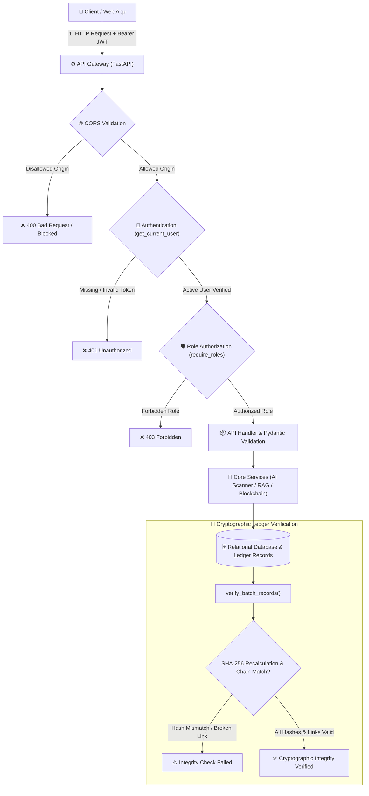

# 🛡️ Farm2Ayur — Security Architecture & Specification

> **"From Soil to Synergy"** — Security posture, access control architecture, data protection controls, and cryptographic integrity verification for the Farm2Ayur platform.

---

### 📋 Security Metadata

-059669?style=for-the-badge&logo=jsonwebtokens)

-yellow?style=for-the-badge)

| Attribute | Details | Attribute | Details |
| :--- | :--- | :--- | :--- |
| **System Name** | **Farm2Ayur** | **Security Baseline** | OWASP Top 10 API Security Alignment |
| **Backend Framework** | FastAPI (Python 3.10+) · Uvicorn | **Authentication** | OAuth2 Bearer Token (JWT / HS256) |
| **Data Protection** | Parameterized ORM · Bcrypt (72-byte cap) | **Data Storage** | SQLite (Dev) / PostgreSQL · SQLAlchemy 2.0 |
| **Integrity Model** | Deterministic SHA-256 Hash Chaining | **Blockchain Stage** | Internal Mock-Chain (Public Anchoring Planned) |

---

## 1. Security Overview

Farm2Ayur handles critical herbal supply chain records, botanical laboratory assays, and consumer health references. The security model prioritizes:

1. **Identity & Authorization:** Restricting sensitive operations (harvest creation, lab verification, blockchain anchoring) via Role-Based Access Control (RBAC).
2. **Data Integrity & Provenance:** Providing mathematical proof of data tampering via deterministic SHA-256 hash chaining.
3. **Botanical & Consumer Safety:** Enforcing confidence thresholds on AI botanical identification and appending mandatory medical disclaimers to AI chat responses.
4. **Transport & Storage Protection:** Using bcrypt password hashing, input sanitization via Pydantic schemas, and parameterized ORM database execution.

---

## 2. High-Level Security Architecture

---

## 3. Authentication and Authorization

### 3.1 JWT Authentication Pipeline (`app/utils/auth.py`)
- **Token Format:** Signed JSON Web Tokens (JWT) using the `HS256` symmetric algorithm.
- **Payload Claims:** Claims include subject ID (`sub`), user email (`email`), user role (`role`), and expiration timestamp (`exp`).
- **Token Lifespan:** Configured via `ACCESS_TOKEN_EXPIRE_MINUTES` (defaults to 1440 minutes / 24 hours).
- **Session Verification:** `get_current_user` decodes the token, validates expiration, queries the database, and verifies `is_active == True`.

### 3.2 Role-Based Access Control (RBAC) Matrix

Access permissions are enforced through the `require_roles(*allowed_roles)` dependency:

| Role Key | Description | Allowed Operations & Endpoint Scopes |
| :--- | :--- | :--- |
| `user` | Public Consumer / Enthusiast | Leaf scanning (`/scan/`), RAG queries (`/chat/query`), public tracking (`/track/{code}`), verification lookups. |
| `collector` | Herb Harvester / Field Worker | Register batches (`POST /batches/`), add harvest events (`POST /batches/{id}/events`), create blockchain anchors. |
| `verifier` | Quality Analyst / Lab Verifier | Submit lab decisions (`POST /verification/`), approve/reject batches, attach Certificates of Analysis (COA). |
| `admin` | Platform Administrator | Full platform control: system health telemetry (`/admin/stats`), user role management, system audits. |

---

## 4. Data Protection & Cryptography

### 4.1 Credential & Secret Management
- **Password Hashing:** Salted hashes generated via `bcrypt` (`bcrypt.hashpw` with `bcrypt.gensalt()`). The implementation truncates passwords to 72 bytes to prevent Denial-of-Service attacks targeting bcrypt's maximum byte limit.
- **Credential Masking:** Passwords and hashes are excluded from all Pydantic response models (`UserResponse`).
- **Environment Variables:** Loaded via `python-dotenv`. A fallback development key is defined if `SECRET_KEY` is not supplied.

### 4.2 Database & Query Security (`app/database.py`)
- **SQL Injection Prevention:** All database operations utilize **SQLAlchemy 2.0 ORM** parameterized queries (`db.query(...).filter(...)`). Raw SQL string concatenation is not used anywhere in the codebase.
- **Cross-Dialect Type Safety:** Custom types (`BigIntPK` and `JSONType`) provide type abstraction between SQLite and PostgreSQL.

---

## 5. API and Application Security

| Security Control | Implementation Detail | Source File | Status |
| :--- | :--- | :--- | :---: |
| **Request Schema Validation** | Strict type enforcement, regex validation, and length constraints via Pydantic v2 schemas. | `app/schemas/*.py` | 🟢 Implemented |
| **CORS Origin Whitelist** | Restricted to localhost dev ports (`http://localhost:3000`, `http://localhost:5173`, `127.0.0.1`). | `app/main.py` | 🟢 Implemented |
| **Upload Extension Whitelist** | Whitelist check accepting only `.jpg`, `.jpeg`, `.png`, `.webp`, and `.pdf` files. | `app/routers/uploads.py` | 🟢 Implemented |
| **Path Traversal Prevention** | Uploaded files are renamed using randomly generated UUIDs (`uuid.uuid4().hex`). | `app/routers/uploads.py` | 🟢 Implemented |
| **File Size Enforcement** | `MAX_FILE_SIZE_MB = 10` is defined as a constant, but active byte-stream checking is omitted. | `app/routers/uploads.py` | 🟡 Partial |
| **Upload MIME-Type Sniffing** | Validates only file extensions without inspecting magic byte signatures. | `app/routers/uploads.py` | 🟡 Partial |
| **Static File Access Control** | Static directory (`/static/uploads`) is served publicly without authentication headers. | `app/main.py` | 🟡 Partial |
| **Rate Limiting** | No global or endpoint-specific rate limiting middleware (e.g., SlowAPI) is currently configured. | `app/main.py` | 🔴 Not Implemented |

---

## 6. AI and Botanical Data Safety

### 6.1 Plant Identification Safeguards (`app/services/ai_identifier.py`)
- **Confidence Gating:** Predictions with confidence below `LOW_CONFIDENCE_THRESHOLD = 0.55` are flagged as `low_confidence`, prompting the user to retake the photo with clearer lighting.
- **Graceful Degradation:** If TensorFlow/Keras fails to load at runtime, an automated heuristic fallback prevents system crashes.
- **Limitation:** The classifier is bounded to 5 trained botanical species (*Amla, Ashwagandha, Guduchi, Neem, Tulsi*). Unseen species outside this set may trigger false positives or default to low confidence.

### 6.2 Ayurvedic Knowledge & RAG Guardrails (`app/services/rag_engine.py`)
- **Curated Context Source:** Document retrieval filters knowledge records using `KnowledgeDocument.is_verified == True`.
- **Mandatory Medical Disclaimer:** Every AI response automatically appends a standardized medical safety disclaimer advising users to consult licensed Ayurvedic physicians.
- **Limitation:** The RAG retrieval pipeline relies on lexical SQL substring matching rather than vector embeddings with guardrail filtering.

---

## 7. Blockchain and Data Integrity

### 7.1 Internal Mock-Chain Architecture (`app/services/blockchain.py`)
Farm2Ayur implements an **internal cryptographic ledger** to provide tamper-evidence without public transaction fees:

1. **Deterministic Serialization:** Batch state snapshots are serialized using canonical sorting:
   $$\text{Canonical JSON} = \text{json.dumps}(\text{payload}, \text{sort\_keys}=\text{True}, \text{separators}=(\text{","}, \text{":"}))$$
2. **SHA-256 Digest Generation:** A 64-character hexadecimal digest is calculated over the canonical byte stream:
   $$\text{data\_hash} = \text{SHA-256}(\text{Canonical JSON})$$
3. **Cryptographic Chaining:** Each new record anchors the previous record's `data_hash` as its `previous_hash`.
4. **Integrity Verification:** The `/blockchain/verify/{batch_id}` endpoint recalculates each block's SHA-256 digest and verifies chain link continuity.

### 7.2 Implemented Mock-Chain vs. Public Blockchain

| Characteristic | 🟢 Implemented (Internal Mock-Chain) | 🔵 Planned (Public Blockchain) |
| :--- | :--- | :--- |
| **Storage Medium** | Database table (`blockchain_records`) | Decentralized public state (EVM / Polygon) |
| **Trust Model** | Mathematical tamper-detection via recalculation | Decentralized consensus & Merkle proofs |
| **Network Cost** | $0.00 (Zero gas overhead) | Network gas fees |
| **Immutability Scope** | Local tamper-evidence (detects altered records) | Global immutable consensus (tamper-proof) |

---

## 8. Security Status Matrix

| Security Domain | Verified Implementation in Code | Status | Recommended Improvement |
| :--- | :--- | :---: | :--- |
| **User Authentication** | OAuth2 Bearer token with JWT (`HS256`) and bcrypt hashing | 🟢 Implemented | Add refresh tokens and account lockout policies. |
| **Role Authorization** | Role check dependency (`require_roles`) on batch and admin routes | 🟢 Implemented | Restrict public self-assignment of privileged roles. |
| **SQL Injection** | Parameterized queries via SQLAlchemy 2.0 ORM | 🟢 Implemented | Maintain strict policy against raw SQL queries. |
| **Path Traversal** | Uploaded files renamed with random UUIDs | 🟢 Implemented | Store uploaded media in secure cloud object storage. |
| **Data Integrity** | Canonical JSON with SHA-256 hash chaining | 🟢 Implemented | Transition to periodic public blockchain anchoring. |
| **AI Safety Guardrails** | Confidence threshold (0.55) & mandatory medical disclaimer | 🟢 Implemented | Add adversarial prompt-injection filtering. |
| **File Upload Validation** | Whitelist file extension check (.jpg, .png, .pdf) | 🟡 Partial | Add active byte size checks and magic byte validation. |
| **Secret Management** | Environment variable loading via `python-dotenv` | 🟡 Partial | Prevent default fallback secrets in production builds. |
| **Static File Protection** | `/static/uploads` served without authentication | 🟡 Partial | Implement authenticated pre-signed URLs for COA files. |
| **Rate Limiting** | No request throttling configured on endpoints | 🔴 Not Implemented | Integrate `slowapi` rate limiting on auth and scan routes. |

---

## 9. Known Limitations and Hardening Roadmap

1. **Role Self-Selection on Registration:** The registration endpoint (`POST /auth/register`) accepts a `role` field from the client. Public registrations should default strictly to `role="user"`, with `collector`, `verifier`, and `admin` roles assigned exclusively by administrators.
2. **Hardcoded Fallback Secret Key:** `auth.py` contains a fallback secret key string if `SECRET_KEY` is not present in `.env`. Production deployments must enforce a mandatory check that terminates startup if `SECRET_KEY` is missing.
3. **File Size & Magic Byte Verification:** In `uploads.py`, file size limits should be enforced before writing chunks to disk, and file headers should be inspected via `python-magic` to prevent extension spoofing.
4. **Rate Limiting & Brute-Force Protection:** Implement IP- and user-based throttling on `/auth/login` and `/scan/` to prevent brute-force credential stuffing and resource exhaustion.
5. **Decentralized Anchoring:** Transition from the internal single-node ledger to periodic state root anchoring on a public EVM-compatible testnet (e.g., Polygon Amoy).

---

## 10. Vulnerability Reporting

If you discover a security vulnerability or potential data-protection risk in the Farm2Ayur codebase:

1. **Do not open a public issue.** Please report the issue privately through GitHub:
   - Navigate to the [Farm2Ayur GitHub Repository](https://github.com/varunurugonda253-aiml/Farm2Ayur).
   - Go to **Security** → **Report a vulnerability** to submit a private security advisory.
2. Include a clear description of the vulnerability, reproduction steps, and potential impact.
3. The project maintainers will review and address the report responsibly.
